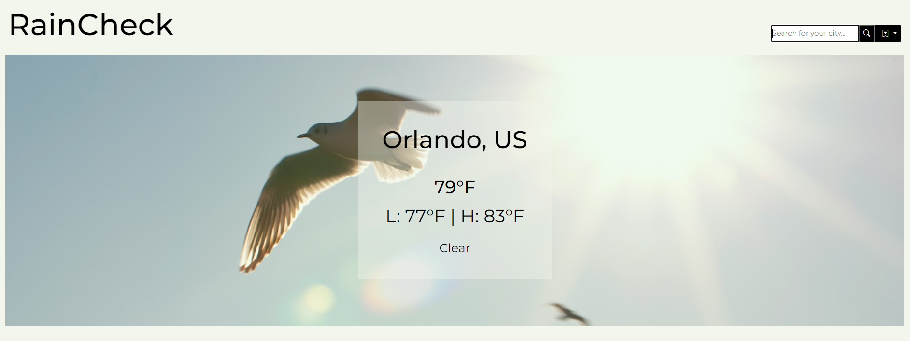
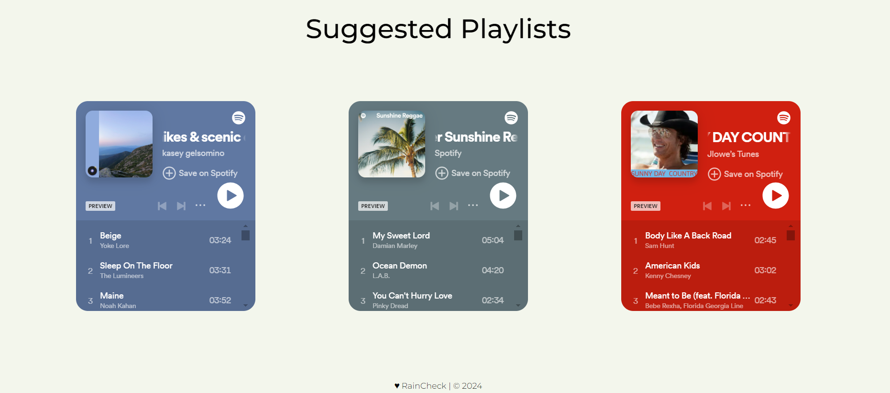

# RainCheck

## Description

RainCheck is a weather app with integrated music based on the current weather conditions of your city. Our motivation behind this project was to combine something mundane, such as the weather, with something more exciting and personalized, like music. Lots of people check the weather everyday, so we wanted to improve this small aspect of their day by providing them with the opportunity to discover new music at the same time. This project was a great learning experience for each group member. With the integration of weather information and Spotify playlists, we had the chance to get comfortable with third-party APIs and the JavaScript involved with that. We also had the opportunity to flex our CSS skills and make a great-looking app.

## Usage

Visit RainCheck here:

To get the most out of RainCheck, start by entering your city to view the current weather conditions. After viewing a city, you can lick the history button to the right of the search button to view the three recent cities you have searched. The theme of the app updates with the current weather conditions. Additionally, three playlists are provided based on the weather conditions, giving the user a soundtrack for their day.

 

## Credits

Collaborators on this project:

<a href="https://github.com/Saydeezr">Saydeez Reyes</a>

<a href="https://github.com/MarlyV1">Marly Valcin</a>

<a href="https://github.com/lauren6198">Lauren Scarborough</a>

<a href="https://github.com/BethanyProctor">Bethany Proctor</a>

<a href="https://github.com/Matt-Carpenter-12">Matt Carpenter</a>

Pictures used for this project:  
Rain: Photo by Inge Maria on Unsplash  
Sun: Photo by Tschernjawski Sergej on Unsplash  
Snow: Photo by Erol Ahmed on Unsplash  
Clouds: Photo by Zbynek Burival on Unsplash  

APIs used for this project:

<a href="https://openweathermap.org/current">Open Weather Map</a>

<a href="https://developer.spotify.com/
">Spotify Developer</a>

